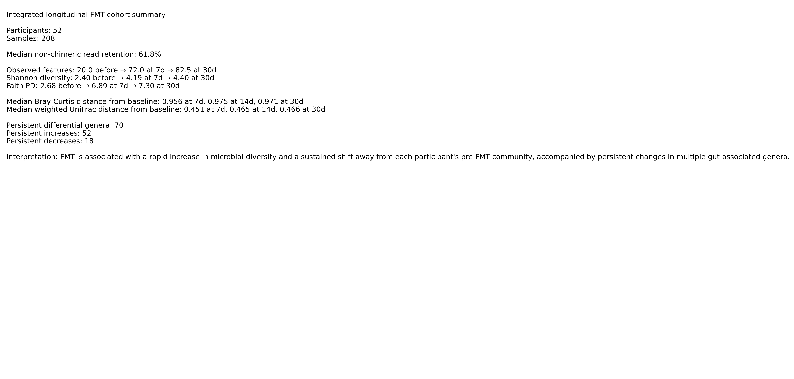

# Longitudinal 16S Microbiome Analysis Following Fecal Microbiota Transplantation

Reproducible longitudinal analysis of gut microbiome recovery following fecal microbiota transplantation (FMT) for recurrent *Clostridioides difficile* infection.

This project reconstructs and analyzes a public 16S rRNA sequencing cohort comprising **52 FMT recipients and 208 longitudinal samples** collected before treatment and at 7, 14, and 30 days post-FMT.

The workflow spans raw sequencing-data acquisition, DADA2 denoising, SILVA taxonomic classification, phylogenetic and ecological diversity analysis, repeated-measures statistics, ANCOM-BC differential abundance, and integrated cohort-level visualization.

## Key Findings

- **Microbial richness increased rapidly after FMT**, with median observed features increasing from 20.0 before FMT to 72.0 at day 7 and 82.5 at days 14 and 30.
- **Post-FMT communities remained strongly displaced from each participant's pre-FMT baseline through day 30**, with median Bray-Curtis distances of 0.956–0.975.
- **ANCOM-BC identified 70 genera with persistent differences from baseline across all three post-FMT timepoints**, including 52 persistent increases and 18 persistent decreases.
- All **12/12 baseline-versus-post-FMT alpha-diversity comparisons** remained significant after multiple-testing correction.

## Skills Demonstrated

Linux / WSL · Python · Bash · QIIME 2 / Rachis · DADA2 · SILVA taxonomy · phylogenetic diversity · repeated-measures analysis · ANCOM-BC · pandas · SciPy · matplotlib · Git / GitHub · reproducible research

## Data Source and Project Contribution

Sequence data were obtained from the publicly available **NCBI BioProject PRJNA298590**.

The computational workflow, cohort reconstruction, reproducible processing pipeline, statistical analysis, visualization, result integration, and repository organization presented here were developed for this project. Raw sequencing data and large regenerable QIIME 2 artifacts are intentionally excluded from version control.

---

## Research Question

**How does gut microbial community structure and composition change during the first 30 days following fecal microbiota transplantation?**

The analysis evaluates:

- sequencing and denoising performance
- alpha-diversity changes
- beta-diversity displacement from each participant's pre-FMT baseline
- longitudinal taxonomic restructuring
- persistent differential taxa following FMT

---

## Cohort Design

The cohort contains **52 participants**, each sampled at four timepoints:

| Timepoint | Description | Samples |
|---|---|---:|
| before | Pre-FMT baseline | 52 |
| 7d | 7 days post-FMT | 52 |
| 14d | 14 days post-FMT | 52 |
| 30d | 30 days post-FMT | 52 |
| **Total** | | **208** |

The balanced longitudinal design allows each participant to serve as their own pre-FMT reference.

Raw sequencing data are retrieved from NCBI SRA and are intentionally excluded from version control.

---

## Analysis Workflow

### Pilot Workflow — Phases 1–7

The project was initially developed and validated using a four-timepoint pilot participant.

The pilot workflow established:

1. raw-data acquisition and quality control
2. paired-end preprocessing and DADA2 ASV inference
3. taxonomic classification
4. alpha- and beta-diversity analysis
5. taxonomic composition analysis
6. longitudinal taxonomic visualization
7. integrated pilot summary

The validated workflow was subsequently expanded to the complete cohort.

---

## Cohort Workflow — Phases 8–16

### Phase 8 — Cohort Metadata

Constructs and validates longitudinal metadata for the complete 52-participant cohort.

### Phase 9 — Cohort FASTQ Acquisition

Downloads and organizes the corresponding NCBI SRA sequencing runs and paired-end FASTQ files.

### Phase 10 — Cohort Preprocessing and DADA2

Processes all 208 samples using paired-end DADA2.

Processing includes:

- quality filtering
- denoising
- paired-read merging
- chimera removal
- ASV inference
- representative-sequence generation
- sequencing-retention assessment

Forward and reverse reads were truncated to:

| Parameter | Value |
|---|---:|
| Forward truncation | 230 bp |
| Reverse truncation | 190 bp |

The cohort median non-chimeric read retention was **61.78%**, with a range of **32.49%–80.26%**.

### Phase 11 — Taxonomic Classification

Cohort-wide ASVs were classified using a locally trained **SILVA 138.2 V4 Naive Bayes classifier**.

A total of **1,571 ASVs** received taxonomic classifications.

### Phase 12 — Cohort Diversity Analysis

Alpha and beta diversity were calculated after rarefaction to **7,500 reads per sample**.

This depth retained:

- 208/208 samples
- 52/52 participants with all four longitudinal timepoints

Alpha-diversity metrics:

- observed features
- Shannon diversity
- Faith's phylogenetic diversity
- Pielou's evenness

Beta-diversity metrics:

- Bray-Curtis
- Jaccard
- weighted UniFrac
- unweighted UniFrac

Within-participant distances were also calculated from each participant's own pre-FMT baseline.

### Phase 13 — Longitudinal Statistics

Repeated-measures analyses were performed across the complete cohort.

Alpha-diversity changes were evaluated using paired non-parametric comparisons and participant-level longitudinal models.

Benjamini-Hochberg correction was applied to pairwise timepoint comparisons.

Beta-diversity displacement from baseline was evaluated longitudinally at 7, 14, and 30 days.

### Phase 14 — Differential Abundance

Differential abundance was evaluated using **ANCOM-BC** at the family and genus levels.

Post-FMT timepoints were compared with the pre-FMT baseline while controlling the false-discovery rate.

Taxa significant across all three post-FMT timepoints were identified as persistent differential taxa.

### Phase 15 — Differential Taxa Visualization

Persistent genus-level ANCOM-BC results were summarized and visualized.

Outputs include:

- timepoint-specific log-fold-change plots
- persistent-taxa heatmaps
- ranked persistent increases and decreases
- selected genus-level result tables

### Phase 16 — Integrated Cohort Summary

The final phase integrates:

- sequencing retention
- alpha diversity
- beta diversity
- longitudinal statistics
- persistent differential abundance

into cohort-level summary tables and figures.

---

## Key Results

### Sequencing

| Metric | Result |
|---|---:|
| Participants | 52 |
| Samples | 208 |
| Median non-chimeric retention | 61.78% |
| Retention range | 32.49%–80.26% |
| Classified ASVs | 1,571 |

### Alpha Diversity

Median values by timepoint:

| Timepoint | Observed Features | Shannon | Faith PD | Evenness |
|---|---:|---:|---:|---:|
| before | 20.0 | 2.402 | 2.678 | 0.560 |
| 7d | 72.0 | 4.190 | 6.887 | 0.686 |
| 14d | 82.5 | 4.545 | 7.070 | 0.708 |
| 30d | 82.5 | 4.400 | 7.297 | 0.714 |

All **12/12 baseline-versus-post-FMT alpha-diversity contrasts** were significant after multiple-testing correction.

These results demonstrate a rapid increase in microbial richness, diversity, phylogenetic diversity, and evenness following FMT.

### Community Displacement from Baseline

Median within-participant distance from pre-FMT baseline:

| Timepoint | Bray-Curtis | Jaccard | Weighted UniFrac | Unweighted UniFrac |
|---|---:|---:|---:|---:|
| 7d | 0.956 | 0.951 | 0.451 | 0.761 |
| 14d | 0.975 | 0.954 | 0.465 | 0.782 |
| 30d | 0.971 | 0.956 | 0.466 | 0.772 |

Post-FMT communities therefore remained strongly displaced from each participant's original baseline through day 30.

### Persistent Differential Genera

ANCOM-BC identified **70 genera** that differed significantly from baseline at all three post-FMT timepoints:

- 52 persistent increases
- 18 persistent decreases

Prominent persistent increases included:

- *Blautia*
- *Bacteroides*
- *Dorea*
- *Anaerostipes*
- *Faecalibacterium*
- *Mediterraneibacter*
- *Anaerobutyricum*
- *Bifidobacterium*
- *Agathobacter*

Prominent persistent decreases included:

- Enterobacteriaceae-associated unresolved taxa
- *Lacticaseibacillus*
- *Veillonella*
- *Lactiplantibacillus*
- *Ligilactobacillus*
- *Escherichia-Shigella*
- *Pediococcus*
- *Megasphaera*
- *Proteus*
- *Fusobacterium*

Together, the diversity and differential-abundance results support rapid and sustained restructuring of the gut microbial community following FMT.

---

## Reproducibility

The analysis is organized into version-controlled scripts:

    scripts/
    ├── 00_environment_and_data_setup.sh
    ├── 01_raw_data_and_qc.sh
    ├── 02_preprocess_and_denoise.sh
    ├── 03_build_silva_classifier.sh
    ├── 03_taxonomic_classification.sh
    ├── 04_diversity_analysis.sh
    ├── 05_taxonomic_composition.sh
    ├── 06_longitudinal_taxonomic_analysis.py
    ├── 07_pilot_summary.py
    ├── 08_build_cohort_metadata.py
    ├── 09_download_cohort_fastqs.sh
    ├── 10_cohort_preprocess_and_denoise.sh
    ├── 11_cohort_taxonomic_classification.sh
    ├── 12_cohort_diversity_analysis.sh
    ├── 13_longitudinal_statistics.sh
    ├── 14_cohort_differential_abundance.sh
    ├── 14_summarize_ancombc.py
    ├── 15_differential_taxa_visualization.py
    └── 16_integrated_cohort_summary.py

Execution logs are retained under `logs/`.

Compact result tables and publication-oriented figures are retained under `results/`.

Large generated QIIME 2 artifacts and raw sequencing files are intentionally excluded from Git.

---

## Software Environment

The analysis was performed under **WSL2 / Ubuntu**.

Primary software includes:

- SRA Toolkit
- FastQC
- Miniconda
- Python 3.12
- QIIME 2 / Rachis 2026.7
- DADA2
- q2-feature-classifier
- q2-diversity
- q2-longitudinal
- q2-composition / ANCOM-BC
- pandas
- SciPy
- matplotlib

The QIIME 2 environment used for the cohort workflow was:

    rachis-qiime2-2026.7

---

## Repository Structure

    microbiome-fmt/
    ├── README.md
    ├── .gitignore
    ├── data/
    │   └── cohort/
    ├── reference/
    ├── scripts/
    ├── logs/
    └── results/
        ├── phase10/
        ├── phase11/
        ├── phase12/
        ├── phase13/
        ├── phase14/
        ├── phase15/
        └── phase16/

Raw SRA archives, FASTQ files, large QIIME 2 artifacts, caches, and other regenerable intermediate files are excluded from version control.

---

## Data Availability

The sequencing data are publicly available through the NCBI Sequence Read Archive.

**NCBI BioProject: PRJNA298590**

Accession mappings and cohort metadata required to reproduce the analysis are documented within the project workflow.

Raw sequencing files are intentionally not committed to Git because of their size.

---

## Interpretation

Across the complete longitudinal cohort, FMT was associated with:

1. rapid increases in microbial richness and diversity,
2. substantial restructuring of community composition relative to pre-FMT baseline,
3. persistence of this altered community structure through at least day 30, and
4. sustained increases and decreases in numerous bacterial taxa.

The balanced repeated-measures design allows these changes to be evaluated within participants rather than relying solely on cross-sectional comparisons.

---

## Project Status

**Cohort analysis complete through Phase 16.**

Completed components include:

- raw-data acquisition and quality control
- DADA2 ASV inference
- SILVA taxonomic classification
- phylogenetic reconstruction
- alpha diversity
- beta diversity
- within-participant baseline-distance analysis
- repeated-measures longitudinal statistics
- ANCOM-BC differential abundance
- persistent-taxa analysis
- differential-taxa visualization
- integrated cohort-level summary

The repository now contains the complete reproducible computational workflow and compact analysis outputs needed for interpretation, reporting, and downstream manuscript development.
